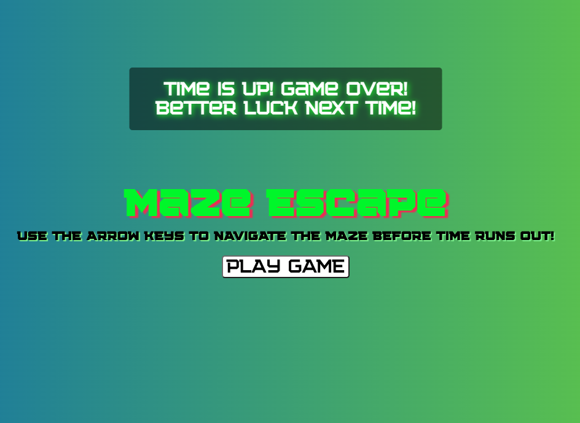
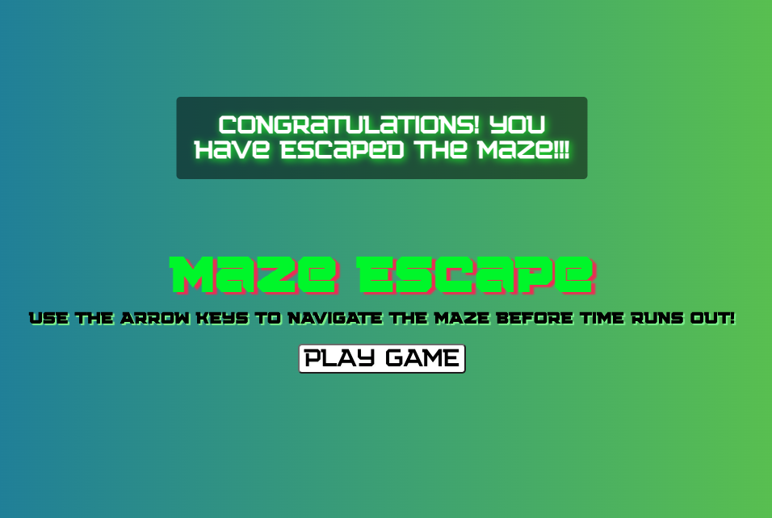

# Maze Escape

Name: James Redden

A maze game is a type of a game where a player navigates from a starting point, through a network of paths and walls to reach a specific end point under timed conditions. Player can navigate the maze by using the arrow keys to reach the end point. If the player does not reach the end point before time runs out then the player loses and the game is over. If the player reaches the end point before time runs out player wins and game is over. Player can then choose to restart the game.  

## Gameplay - Screenshots

#### MVP Screenshots:

## Technologies Used

*  HTML
*  CSS
*  JS

## Key Resources

1. MDN web
2. W3
3. StackOverflow
4. Switch: detecting arrow key presses: https://www.tutorialspoint.com/detecting-arrow-key-presses-in-javascript#:~:text=The%20key%20codes%20for%20the,arrow%20key%20presses%20in%20JavaScript.
5. Break: https://developer.mozilla.org/en-US/docs/Web/JavaScript/Reference/Statements/break
6. Color gradient: https://www.w3schools.com/css/css3_gradients.asp

## Getting Started

In this section include the link to your deployed game and any instructions you deem important.

## Future Enhancements

1. Adding obstacles in the maze for a more challenging experience
2. Adding a second level that player can move onto if player wins
3. Adding a point system which will allow player to collect items that are worth points while trying to reach the end point under timed conditions.
