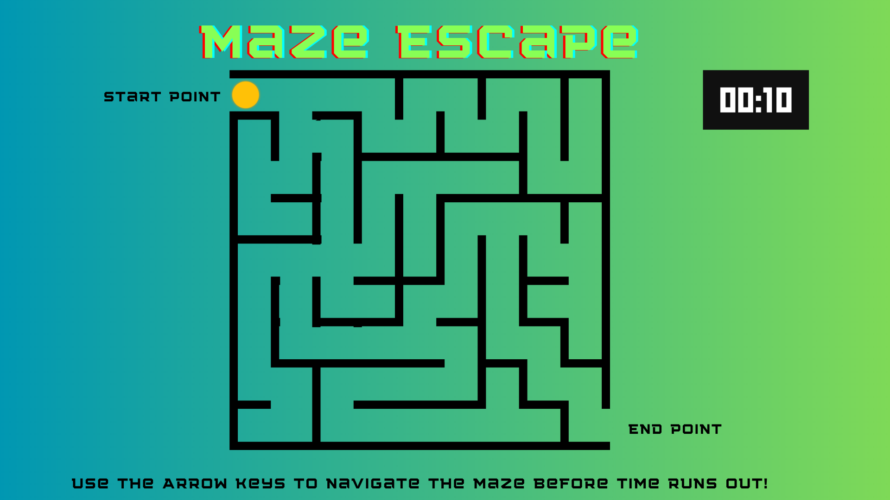

# Maze Escape

## Wireframe

created this using Canva.

## Pseudocode 

###Big Picture Pseudocode:

### 1. Set up HTML Structure:
- Create a html container with class "grid" for the game board
### 2. Define CSS styles in style.css:
- Set styling for game grid and different elements/components w/in game (i.e. player, walls, path, etc.)
### 3. JS Game Logic Pseudocode:
-  Create a maze grid using 2D array. I will be using nested arrays for this.
- Initialize variables (i.e. grid, timer, etc.)
- create a function to generate maze grid game board
- Define function to move player within the maze grid
- Implement a timer by creating a timer function
- Create functions for win/loss conditions 
- Remove player's ability to move through the maze when timer stops and game ends

### 4. Detailed Pseudocode: 
1. Define required constants:
  - width 28 (this is the maze grid width)
2. Define required variables used to track the state of the game
  - playerCurrentIndex: 28 (this is the initial position of player in the maze grid layout)
  - gameOver: boolean added to track if game is over or not
3. Store elements on the page that will be accessed in code more than once in variables to make code more concise, readable and performant.
  - mazeGrid: HTML element that represents maze grid
  - TimerEl: HTML element that represents countdown timer
  - StartEL: HTML element that represents the start prompt
  - StartBtn: HTML button for starting game
4. Upon loading the game should:
  - Initialize the state variable - playerCurrentIndex = 28
  - Set gameOver to false
  - Render values to the page - Call createMaze() to render layout
5. Handle a player interacting with the maze grid:
  - Implement the movePlayer(event) function to handle arrow keys pressed and move player within maze.
  - Update the playerCurrentIndex variable to reflect player's new position 
  - Check if player reached the end to declare if player won/lost
  - Update mazeGrid to show player's new position
6. Handle a player clicking the replay button:
  - Add a replay button element to HTML
  - Add an event listener to replay button to restart the game when clicked
  - Reset the playerCurrentIndex to the initial position
  - Clear previous interval and countdown timer
  - Call createCountdownTimer() to start timer again

### 5. Functions:

//Function to render maze layout:
createMaze(): renders maze layout based on gridLayout array and add event listeners to maze squares

//Function to move player with arrow keys:
movePlayer(event): registers arrow key press to move player within the maze

//Function to create countdown timer:
createCountdownTimer(callback): initialize countdown timer and update timer element

//Function to start game when PLAY BTN is pushed:
startGame()

//Function to declare player won:
playerWins()

//Function to declare player lost:
playerLoses()

//Function to reset game:
resetgame()

### 6. Stretch Goals:
- Add Audio
- replace player dot with an image 