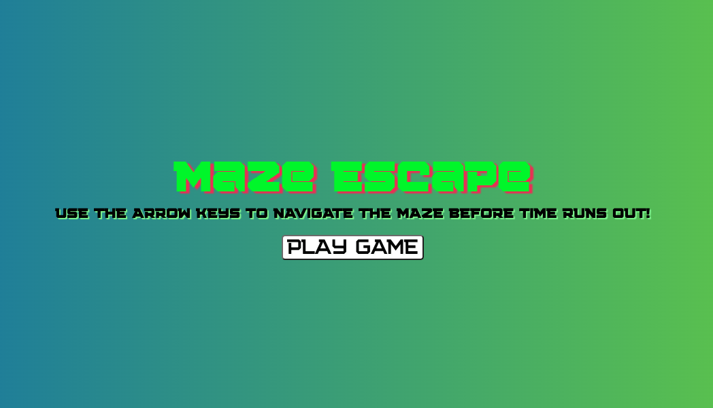

# Maze Escape

## Wireframe

created this using Canva.

## Pseudocode

### 1. Set up HTML Structure
- Create a html container with class "grid" for the game board
### 2. Define CSS styles in style.css 
- Set styling for game grid and different elements/components w/in game (i.e. player, walls, path, etc.)
### 3. JS Game Logic Pseudocode
-  Create a naze grid using 2D array. I will be using nested arrays for this.
- Initialize variables (i.e. grid, timer, etc.)
- create a function to generate maze grid game board
- Define function to move player within the maze grid
- Implement a timer by creating a timer function
- Create functions for win/loss conditions 
- Remove player's ability to move through the maze when timer stops and game ends

### 4. Some of the JS Methods I will likely be using:

- addEventListener()
- removeEventListener
- getElementById()
- querySelector()
- for Loop
- appendChild()
- createElement()
- if else statements
- forEach()
- constructor
- setInterval()
- render()
- renderWinner()
- renderCountdown()
- event.key (Key Property for keyboard interactions)